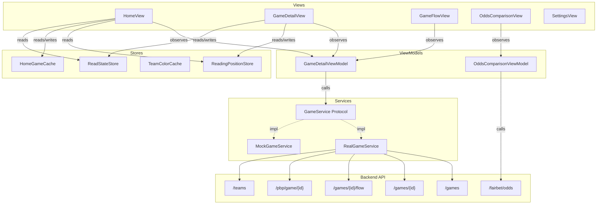

# Architecture

System architecture, data flow, and design principles for both iOS and web apps.

For directory layouts, data models, API endpoints, and environment reference, see [AGENTS.md](../AGENTS.md).

## iOS MVVM Data Flow



Views never call services directly. ViewModels mediate all data access.

The app is a **thin display layer**. The backend computes all derived data (period labels, play tiers, odds outcomes, team colors, merged timelines). The ViewModel reads these pre-computed values and exposes them to views.

## Core Principles

See [AGENTS.md — Core Principles](../AGENTS.md) for Progressive Disclosure, the Reveal Principle, and User-Controlled Pacing.

## Server-Driven Data

See [AGENTS.md — Server-Driven Data](../AGENTS.md) for the full list of server-provided values.

### Team Color System

Team colors come from two sources:
1. **Bulk fetch** — `TeamColorCache.loadCachedOrFetch()` on app launch, cached in UserDefaults (7-day TTL)
2. **Per-game injection** — API responses include `homeTeamColorLight`/`homeTeamColorDark` fields, injected into `TeamColorCache` on load

```
App Launch → TeamColorCache.loadCachedOrFetch()
                    │
                    ├─ Disk cache valid? → Use cached colors
                    └─ Expired/empty?    → GET /api/admin/sports/teams → cache

Game Detail / Flow / Home Feed → inject(teamName:lightHex:darkHex:)
                                     │
DesignSystem.TeamColors.color(for:) → TeamColorCache.color(for:)
                                         │
                                         ├─ Exact match? → (light, dark) UIColor pair
                                         ├─ Prefix match? → (light, dark) UIColor pair
                                         └─ Unknown? → .systemIndigo
```

Color clash detection prevents two similar team colors in matchup views.

## Flow Rendering

See [AGENTS.md — Flow Architecture](../AGENTS.md) for the blocks/FlowAdapter/views overview.

### Block Structure

Each `FlowBlock` contains:
- `blockIndex` — Position in the flow (0 to N-1)
- `role` — Server-provided semantic role (SETUP, MOMENTUM_SHIFT, etc.) — not displayed
- `narrative` — 1-2 sentence description (~35 words)
- `miniBox` — Player stats for this segment with `blockStars` array
- `periodStart`/`periodEnd` — Period range covered
- `scoreBefore`/`scoreAfter` — Score progression as `[away, home]`
- `keyPlayIds` — Plays explicitly mentioned in narrative

### NHL-Specific Models

| Model | Description |
|-------|-------------|
| `NHLSkaterStat` | Skater stats (TOI, G, A, PTS, +/-, SOG, HIT, BLK, PIM) |
| `NHLGoalieStat` | Goalie stats (TOI, SA, SV, GA, SV%) |

## Team Stats

See [AGENTS.md — Team Stats](../AGENTS.md) for the KnownStat pattern overview.

```
API Response (JSONB stats dict)
     │
     ▼
KnownStat definitions (ordered list)
     │ For each: try keys[0], keys[1], ... against stats dict
     ▼
TeamComparisonStat (name, homeValue, awayValue, formatted display)
     │
     ▼
TeamStatsContainer → grouped by Overview / Shooting / Extra
```

Each `KnownStat` lists all possible API key variants for a stat, a display label, a group, and whether it's a percentage. Stats only appear if the API returned data for at least one key variant. No client-side derived stats.

Player stats use direct key lookup against `PlayerStat.rawStats`.

## FairBet Architecture

See [AGENTS.md — FairBet](../AGENTS.md) for the pipeline overview.

**Server-side EV (preferred):**
- The server computes `trueProb` via Pinnacle devig and provides per-bet `evConfidenceTier` (`full`/`decent`/`low`)
- Per-book `evPercent` and `isSharp` annotations enable direct EV display without client computation
- `referencePrice` and `evDisabledReason` provide transparency about the fair odds source
- `OddsComparisonViewModel.computeEVResult()` checks for server annotations first

**Client-side EV (fallback):**
- `BetPairing` pairs opposite sides via sharp book (Pinnacle, Circa, BetCris) vig-removal and median aggregation
- Confidence levels: high (2+ sharp books), medium (1 sharp book), low (no sharp books)
- Per-book EV using fair probability via `EVCalculator`
- Fee model supports `percentOnWinnings` for future P2P/exchange integration

**Progressive loading:** `OddsComparisonViewModel.loadAllData()` fetches the first 500-bet page and displays immediately, then loads remaining pages concurrently (max 3 in-flight via `TaskGroup`) with incremental EV computation (`computeEVsForNewBets`). A "Loading more bets…" indicator shows at the bottom of the list during background loading.

**FairExplainerSheet — "Show the Math":**
`FairExplainerSheet` (opened by tapping the FAIR card on any bet) presents a numbered step-by-step math walkthrough:
1. Convert reference odds to implied probabilities (total > 100% reveals the vig)
2. Identify the vig (total implied vs. 100%)
3. Remove the vig via normalization to get fair probability and odds
4. Calculate EV at the best book price with full dollar math

Median/consensus bets simplify to 2 steps. Missing data (no opposite reference price, no EV) falls back gracefully. Per-book implied probabilities are available in a disclosure group below the walkthrough.

## Configuration

The app uses `AppConfig` to manage runtime behavior:

```swift
AppConfig.shared.environment  // .live (default), .localhost, or .mock
AppConfig.shared.gameService  // Returns appropriate service implementation
```

### Dev Clock

`AppDate.now()` provides consistent timestamps:
- **Mock mode:** Fixed to November 12, 2024
- **Snapshot mode:** Frozen to user-specified date
- **Live mode:** Real system time

## Game Status Lifecycle

See [AGENTS.md — Game Status & Lifecycle](../AGENTS.md) for the full `GameStatus` enum, computed properties (`isLive`, `isFinal`, `isPregame`), and SSOT rules.

Key behavior:
- **Live games:** ViewModel polls every ~45s (`startLivePolling`), shows PBP as primary content, auto-stops on dismiss or final transition
- **Final games:** Shows Game Flow as primary content (falls back to PBP if no flow data)
- **Content switching:** When a live game transitions to final, polling stops automatically. The view re-renders based on the updated `game.status` — if flow data was already loaded, it displays; otherwise PBP remains as fallback. No automatic flow fetch is triggered on transition.
- **PBP access:** A "PBP" button in the section navigation bar (top right) opens the full play-by-play sheet. Available whenever PBP or unified timeline data exists, including when Game Flow is the primary view.
- **Read state gating:** `markRead` requires a `GameStatus` and silently ignores non-final games

## Reading Position Tracking

Local-only (UserDefaults-backed) tracking of where the user stopped reading a game's PBP or Game Flow.

```
User scrolls PBP/Flow → updateResumeMarkerIfNeeded()
                              │
                              ├─ PBP play visible?  → save playIndex (positive)
                              └─ Flow block visible? → save -(blockIndex+1) (negative)
                              │
                              ▼
                    ReadingPositionStore.save()
                        (playIndex, period, gameClock, labels)
                              │
User returns to game ─────────┘
                              │
                              ▼
                    loadResumeMarkerIfNeeded()
                              │
                              ├─ Position found + autoResumePosition ON?  → Auto-scroll to saved play/block
                              ├─ Position found + autoResumePosition OFF? → Show resume prompt
                              └─ No position?   → Start from top
```

Flow blocks use negative-encoded `playIndex` values (`-(blockIndex + 1)`) to share the same `ReadingPosition` model and `PlayRowFramePreferenceKey` infrastructure as PBP plays. `resumeScroll()` decodes the sign to determine the scroll ID format (`"block-N"` vs `"play-N"`).

`ReadingPositionStore` is the SSOT for resume position and saved scores. Uses an in-memory `scoreCache` to avoid repeated UserDefaults reads; `preload(gameIds:)` warms the cache for batch scenarios. `gameTimeLabel(for:)` is the SSOT display method — returns game-time strings (e.g., "@ Q3 5:42") shown under scores in the game header and home card. Methods: `savedScores(for:)`, `updateScores(for:awayScore:homeScore:)`, `gameTimeLabel(for:)`, `preload(gameIds:)`.

## Score Reveal Preference

`ScoreRevealMode` (stored in `ReadStateStore.scoreRevealMode`):

| Mode | Behavior |
|------|----------|
| `.onMarkRead` | Spoiler-free: show score only after explicitly marking as read or hold-to-reveal (default) |
| `.always` | Always show scores on cards and headers |

Hold-to-reveal (long press on score area) lets users check scores without changing preference. Live games support hold-to-update for fresh scores.

## Game Detail View Structure

`GameDetailView` is split into focused extensions. See [AGENTS.md](../AGENTS.md) for the full file table.

Sections render inside a `LazyVStack(pinnedViews: [.sectionHeaders])`. Each section uses `PinnedSectionHeader` for a sticky header that pins when scrolled past, paired with `.sectionCardBody()` for content styling. Content renders conditionally based on game status and data availability:
- **Pregame (Overview):** Matchup context
- **Timeline:** Live PBP (for live games) or Flow blocks (for final games); falls back to PBP if no flow data
- **Stats:** Player stats + team comparison
- **NHL Stats:** Sport-specific skater/goalie tables
- **Odds:** Cross-book comparison table with category tabs and collapsible grouped rendering (mainline grouped by Moneyline/Spread/Total, team props by team, player props by player+stat) — shown when `hasOddsData` is true
- **Wrap-Up:** Post-game final score, highlights (only for truly completed games with confirmation signals)

## Interaction Patterns

All interactive elements use consistent patterns:

| Pattern | Implementation |
|---------|----------------|
| Tap feedback | `InteractiveRowButtonStyle` (opacity 0.6 + scale 0.98) |
| Chevron rotation | `chevron.right` with 0°→90° on expand |
| Expand animation | `spring(response: 0.3, dampingFraction: 0.8)` |
| Transitions | Asymmetric (opacity + move from top) |

---

## Web App Architecture

### Data Flow

```
Browser (React)
    ↓ fetch("/api/games")
Next.js API Route (server-side)
    ↓ apiFetch() with X-API-Key header
Backend API (sports-data-admin.dock108.ai)
    ↓ JSON response
Next.js API Route
    ↓ NextResponse.json()
Browser → React hook (useGames/useGame) → Component re-render
```

The web app uses **Next.js API routes as a proxy layer**. Client-side code calls local `/api/*` routes, which forward requests to the backend with authentication. This keeps the API key server-side.

### Component Architecture

Pages are thin orchestrators. Components handle rendering:

```
page.tsx (route)
    ├─ useGames() / useGame() / useFairBetOdds()    # Data fetching
    ├─ useSettingsStore() / useReadStateStore()       # Zustand state
    └─ <GameSection> / <GameHeader> / <BetCard>      # Components
```

Components are organized by feature area (`home/`, `game/`, `fairbet/`, `layout/`, `shared/`). See [AGENTS.md — Web Directory Layout](../AGENTS.md) for the full tree.

### State Management

Three Zustand stores persist to `localStorage`:

| Store | Purpose | Persistence Key |
|-------|---------|-----------------|
| `settings` | Theme, odds format, score reveal, preferred book, sort option | `sd-settings` |
| `read-state` | Which games the user has marked as read | `sd-read-state` |
| `reading-position` | Per-game scroll position and score snapshot | `sd-reading-position` |

### Caching

- **In-memory LRU** — `useGame` maintains a 5-minute TTL cache with max 8 entries for game detail responses
- **ISR** — Next.js API routes use `revalidate` for server-side caching (60s game list, 30s game detail)
- **No service worker** — Cache is in-memory only, cleared on page reload

### Server-Driven Display

The same principle as iOS: the backend computes all derived data. The web app renders pre-computed values (period labels, play tiers, odds outcomes, team colors). See [AGENTS.md — What the Server Provides](../AGENTS.md).

### Deployment

Docker-based, deployed to Hetzner VPS:

```
GitHub Push (main) → CI (lint + build) → Docker Build → GHCR Push → SSH Deploy to Hetzner
```

The container runs at `127.0.0.1:3000` and is reverse-proxied to `scrolldownsports.dock108.dev`. See [ci-cd.md](ci-cd.md) for the full pipeline.
